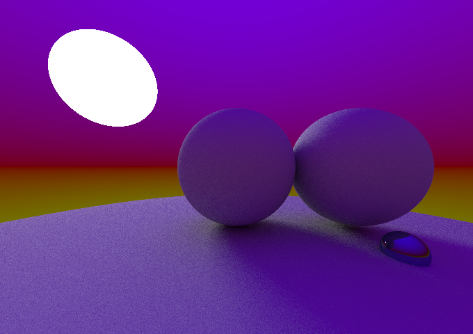

# A basic path tracer, written in rust.

This is my first implementation of a path tracer. Its architecture is loosely based on ssloy's [tinyraytracer](https://github.com/ssloy/tinyraytracer) and ["Ray tracing in one weekend" (Shirley et. al.)](https://raytracing.github.io/books/RayTracingInOneWeekend.html).

The program simulates light propagation with non-deterministic rays that interact with various surfaces.

## Features

- The path tracer can render spheres, triangles, as well as any mesh that consists only of triangles (loaded from .obj files).
- The render materials implement base color, emissive and roughness controls.
- The clear color is angle-dependant, but does **not** support cubemap textures.
- The pipeline implements very basic anti-aliasing.
- Rendering is **multithreaded** and done on the CPU.

## How to run

The following assumes the Rust toolchain is installed.

For a release build, run `cargo build --release`. Navigate to `build/release`, and run `basic-raytracer`. The output will be found in the same directory, in a file called output.ppm.

For a debug build, from anywhere within the project, run `cargo run`. The output image will be found in the project root directory.
**I recommend against this, at least with the scene I've set up, unless you want to wait for an eternity or two.**

**Observe:** I've made a point to implement as much as possible from scratch. For example, the vector facilities used are self-implemented. Indeed, the only external crates used are the rand and rand_dist crates. For simplicity's sake, the output format is chosen to be a .ppm image, which may prove difficult to open for viewing. Some image viewers that support the format are GIMP and feh. Conversion to .png can be done with a tool such as the [NetPBM suite](https://netpbm.sourceforge.net/).

### Some examples of renders:

\
_A simple scene. 20 bounces, 10000 samples_\

\
_A scene with a famous rabbit. 5 bounces, 100 samples. Note that the rabbit is levitating slightly._

The last scene took about 20 minutes to render on a machine with an i7-1165G7, running Arch Linux.
The scene consists of five spheres, as well as a Stanford bunny with approximately 5000 triangles.
